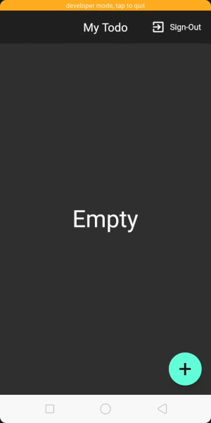
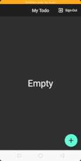

# my_todo_firebase

 - A todo app build with flutter and firebase.
## Features
 - authentication option added using firebase authentication.
 - sort tasks on basis of date.
 - forget password option added.
 - show loading screen while linking to firestore.
 - splah screen added.
 - show alert dialogs when nessesary eg on wrong password,user already log in..
 - show internet error dialog when internet is not available.
# Demo
  
  
  
## Getting Started

This project is a starting point for a Flutter application.

A few resources to get you started if this is your first Flutter project:

- [Lab: Write your first Flutter app](https://flutter.dev/docs/get-started/codelab)
- [Cookbook: Useful Flutter samples](https://flutter.dev/docs/cookbook)

For help getting started with Flutter, view our
[online documentation](https://flutter.dev/docs), which offers tutorials,
samples, guidance on mobile development, and a full API reference.
